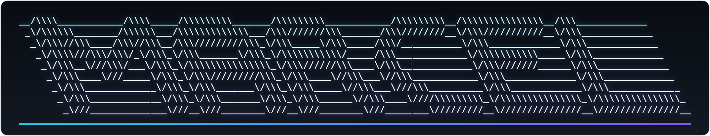

 

 

 

## About

- Broad-spectrum builder spanning systems programming, web development, and Linux — kernels and compilers one day, full-stack apps the next.
- Daily-drives Arch Linux on a Lenovo Legion Y7000, with hands-on time across Bazzite, FydeOS, and Alpine too.
- Believes in production-grade, zero-placeholder code: detailed specs in, finished implementations out.
- Drawn to retro computing aesthetics — Windows XP/7 chrome, the 2006-era web, and CRT terminal glow.
- Tinkers with audio synthesis on the side: bytebeat formulas and speech-synth recreations like klattsch.
- Runs his own infrastructure end to end — mail, git hosting, and a handful of self-hosted services.

 

## Tech Stack

 

## Featured Projects

| Project | Description | Stack |
|---|---|---|
| [**OpenTube**](https://code.european-comission-europa.eu/m4rcel/opentube) | Self-hostable YouTube-style platform with a full transcoding pipeline and a deliberate 2006-era look | Fastify · React · PostgreSQL · FFmpeg |
| [**CineHorizon**](https://code.european-comission-europa.eu/m4rcel/cinehorizon) | A Netflix clone built to be easy to self-host and manage, with uploads handled through an admin panel | React · Node.js · PostgreSQL · HLS |
| [**AXON**](https://code.european-comission-europa.eu/m4rcel/axon) | A custom programming language with an LLVM backend, full toolchain, and package manager | LLVM · Compiler Design |
| [**WinGit**](https://code.european-comission-europa.eu/m4rcel/wingit) | A CLI package manager for Windows | Windows · CLI |
| [**brewski**](https://code.european-comission-europa.eu/m4rcel/brewski) | A Homebrew-flavored TUI for managing packages on macOS | macOS · Terminal UI |

*Links assume a `m4rcel` namespace and lowercase repo slugs on the instance — swap in the real ones if any differ.*

 

## GitHub Stats

 

## Self-Hosted Infrastructure

| Service | Stack | Notes |
|---|---|---|
| Git forge | Forgejo | `code.european-comission-europa.eu` — self-hosted home for personal repos and collaboration |
| Fediverse microblogging | Sharkey | `index.sark` — a fork of Misskey |

 

## Connect

Also runs the **Cirql** community and is currently building **MPCT** (Multi Purpose CLI Tool).

 

Thanks for stopping by.

